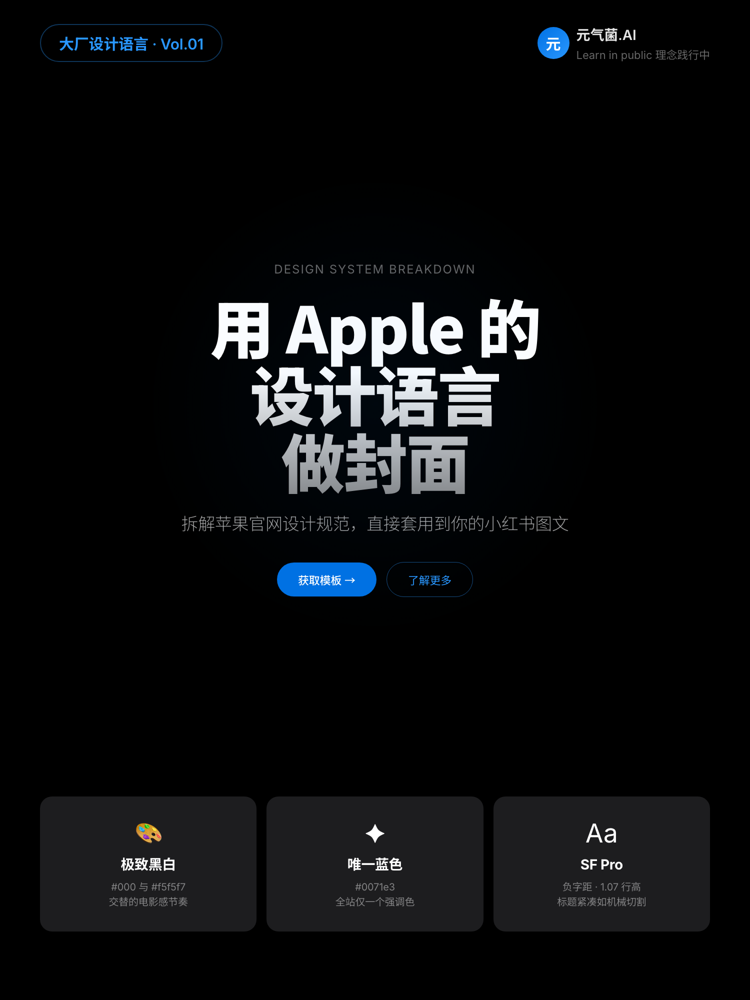

# 🎨 XHS Cover from DESIGN.md

> Turn any company's DESIGN.md into stunning Xiaohongshu (小红书) covers with AI.

把任意大厂的 [DESIGN.md](https://github.com/VoltAgent/awesome-design-md) 设计规范，一键转化为小红书封面。



## How it works

```
DESIGN.md (大厂设计规范)
    ↓  Extract visual DNA (color, typography, components)
    ↓  COVER.md (封面模板规范)
    ↓  Feed to any AI (ChatGPT / Claude / Cursor)
    ↓  Generate HTML → Screenshot 3:4 PNG
    → Post to Xiaohongshu 🚀
```

## 9 Styles Available

| Vol | Brand | Style | Preview |
|-----|-------|-------|---------|
| 01 | 🍎 Apple | Pure black × Apple Blue × Pill buttons | [→](covers/apple/) |
| 02 | 🧱 Claude | Parchment × Terracotta × Serif | [→](covers/claude/) |
| 03 | ⌨️ OpenCode | Warm dark × Monospace × Sharp 4px corners | [→](covers/opencode/) |
| 04 | 🎨 Figma | Pure B&W × Ultra-light weight × Rainbow glow | [→](covers/figma/) |
| 05 | 📄 Notion | Warm white × Whisper borders × Notion Blue | [→](covers/notion/) |
| 06 | 📌 Pinterest | Bold red × Sand gray × Crafty roundness | [→](covers/pinterest/) |
| 07 | 🚗 Tesla | Radical whitespace × Electric Blue × Zero decoration | [→](covers/tesla/) |
| 08 | 🚀 Raycast | Deep space blue-black × Coral red × Glass depth | [→](covers/raycast/) |
| 09 | 🏠 Airbnb | Rausch red × Triple soft shadow × Rounded warmth | [→](covers/airbnb/) |

## Quick Start

### 1. Pick a style

Browse the `covers/` directory and pick a brand style you like.

### 2. Feed COVER.md to AI

Copy the COVER.md content to any AI, replace the title and subtitle:

```
Please generate a 1500×2000px Xiaohongshu cover HTML following this COVER.md spec.

Title: 用 Apple 的设计语言做封面
Subtitle: 拆解苹果官网设计规范，直接套用到你的小红书图文

[Paste COVER.md content here]
```

### 3. Screenshot

Open the generated HTML in Chrome (viewport 1500×2000), screenshot, done.

Or use the script:
```bash
chmod +x scripts/capture.sh
./scripts/capture.sh covers/apple/template.html output.png
```

## COVER.md Format

Each COVER.md contains:

| # | Section | Purpose |
|---|---------|---------|
| 1 | Cover Identity | Style name, vibe, best-for scenarios |
| 2 | Color System | Background, text, accent colors with HEX |
| 3 | Typography | Font size, weight, line-height, letter-spacing per element |
| 4 | Layout Structure | Cover zone breakdown with ASCII diagram |
| 5 | Component Specs | Button, card, tag CSS specs |
| 6 | Do's and Don'ts | Design guardrails |
| 7 | AI Prompt Template | Copy-paste prompt for AI generation |
| 8 | Customization Guide | How to swap themes, platforms, content |

## Create Your Own

1. Find a DESIGN.md from [awesome-design-md](https://github.com/VoltAgent/awesome-design-md)
2. Extract the visual DNA (colors, fonts, components, principles)
3. Map to the COVER.md format for XHS cover zones
4. Write the AI Prompt Template
5. Test generate → refine → PR welcome!

## Cover Zone Structure

```
┌─────────────────────────────────┐
│  Series Tag          Author ID  │  ← Top bar
├─────────────────────────────────┤
│                                 │
│         OVERLINE                │
│     ██ HEADLINE ██              │  ← Hero zone (~55%)
│       Subtitle                  │
│     [CTA]  [CTA]               │
│                                 │
├─────────────────────────────────┤
│  ┌─────┐ ┌─────┐ ┌─────┐     │  ← Feature cards (3-col)
│  │  1  │ │  2  │ │  3  │     │
│  └─────┘ └─────┘ └─────┘     │
├─────────────────────────────────┤
│  (Tag) (Tag) (Tag) (Tag)       │  ← Series navigation
└─────────────────────────────────┘
```

## Credits

- Design systems extracted from [awesome-design-md](https://github.com/VoltAgent/awesome-design-md) by VoltAgent
- Concept & covers by [元气菌.AI](https://www.xiaohongshu.com/user/profile/56cbbaf9aed7586fcc5a0eee)

## License

MIT
